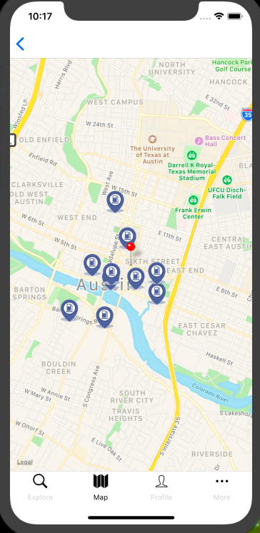

# ChargingSpot

ChargingSpot brings electric vehicle charging to more people and places than ever before with the world's largest and most open EV charging network. 

### How to run locally on simulator

* Fork and Clone this repository.
* Run `react-native run-ios` command into the source folder.
* Make sure Xcode is downloaded in your desktop

### BEST FEATURE

The app lets the user locate near by charging station as well as give them ability to become EV charging provider.

### TECHNOLOGIES

* React Native
* Firebase
* Expo CLI
* Xcode

